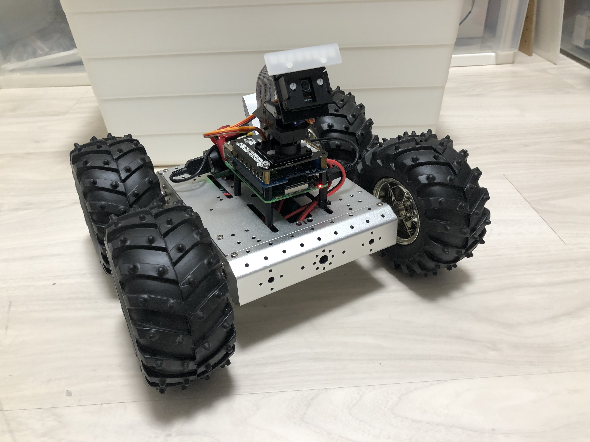

# Simple Wireless Rover for Raspberry Pi

Small robotic platform based on Raspberry Pi controlled by a remote PS4 game controller over a wireless network.

## Kickstart Guide

### 1. Install requirements
`pip3 install -r requirements.txt`

### 1.5. Install dependencies in Ubuntu server machine:
`sudo apt-get install python3-smbus`  

### 2. Start server in Raspberry Pi:
`python3 robotServer.py`

### 3. Start the client on a remote machine
Connect game controller to remote machine. Configure the correct server IP on client and run `python3 client.py` on the remote machine.

`client.py -h <host> -p <port> [--verbose]`

### Controller
- **Right pad:** Speed, turning and steering
- **Left pad:** Look with camera
- **Hat pad:** Move camera center

## Current Hardware
- Raspberry Pi 3 with Ubuntu Server LTS 20.04
- Adafruit Motor Hat https://www.adafruit.com/product/2348
- Pimorini Pantilt Hat https://shop.pimoroni.com/products/pan-tilt-hat 
- 4x 5-12V DC gear motors
- 12V battery pack for motor power
- USB battery pack for Raspberry Pi 3

ethernets: